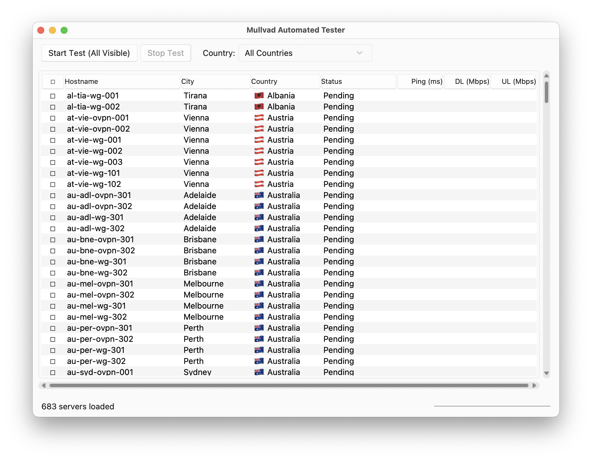

# Mullvad Server Tester V2

**GitHub Repository:** [https://github.com/Lichiel/Mullvad-Server-Tester-V2](https://github.com/Lichiel/Mullvad-Server-Tester-V2)

A graphical user interface (GUI) application built with Python and Tkinter for automatically testing the performance (ping and speed) of Mullvad VPN servers. It helps you find the fastest and most responsive servers for your location.

## Screenshot



## How It Works

This application interacts with two external command-line tools:

1.  **Mullvad CLI:** Provided by the official Mullvad VPN desktop client, used to connect to specific servers, disconnect, and check status.
2.  **Ookla Speedtest CLI:** Used to perform network speed tests (download/upload) through the active Mullvad connection.

The GUI allows you to select servers, initiate the testing sequence, and view the results.

## Prerequisites

Before you begin, ensure you have the following installed and configured:

1.  **Python 3:**
    *   Verify installation by opening your terminal or command prompt and typing `python --version` or `python3 --version`.
    *   Tkinter support is usually included. If you encounter errors related to `_tkinter` when running the app, you might need to install it (e.g., `sudo apt-get install python3-tk` on Debian/Ubuntu, or reinstall Python ensuring Tk/Tcl support is included on other systems).

2.  **Mullvad VPN Client:**
    *   The official Mullvad desktop application **must be installed**.
    *   Download from [mullvad.net](https://mullvad.net/).
    *   **Important:** Run the Mullvad client at least once after installation. This generates the `relays.json` cache file that this tool needs to load the server list.

3.  **Ookla Speedtest CLI:**
    *   This tool requires the official Speedtest CLI from Ookla, **not** other speedtest scripts.
    *   **Installation (macOS with Homebrew):**
        ```bash
        brew tap teamookla/speedtest
        brew update
        brew install speedtest --force
        ```
    *   **Installation (Other Systems):** Download from [speedtest.net/apps/cli](https://speedtest.net/apps/cli). Follow their instructions to place the executable in a directory included in your system's PATH (so you can run `speedtest` from any terminal location).
    *   **License Acceptance:** After installing, **you must run `speedtest` once manually** in your terminal to view and accept the license agreement. The application cannot do this automatically.

## Installation

Follow these steps to get the application code onto your computer:

1.  **Choose a Download Method:**
    *   **Option A (Using Git - Recommended):** If you have Git installed, open your terminal and run:
        ```bash
        git clone https://github.com/Lichiel/Mullvad-Server-Tester-V2.git
        ```
        This will create a `Mullvad-Server-Tester-V2` folder with the code.
    *   **Option B (Direct Download):**
        1.  Go to the [GitHub Repository](https://github.com/Lichiel/Mullvad-Server-Tester-V2).
        2.  Click the green "<> Code" button.
        3.  Select "Download ZIP".
        4.  Save the ZIP file and extract its contents to a folder on your computer.

2.  **Install Optional Theme Library (Recommended):** For a more native look and feel, especially on macOS and Windows, install the `sv-ttk` theme library:
    *   Open your terminal or command prompt.
    *   Navigate (`cd`) into the `Mullvad-Server-Tester-V2` folder you created in step 1.
    *   Run:
        ```bash
        pip install sv-ttk
        ```
        *(If `pip` isn't found or linked to Python 2, try `pip3 install sv-ttk`)*

## Running the Application

1.  **Verify Prerequisites:** Double-check that Python 3, the Mullvad Client (run once), and the Speedtest CLI (run once) are installed and configured correctly. Ensure the `mullvad` and `speedtest` commands work from your terminal.

2.  **Open Terminal/Command Prompt:** Launch your terminal (macOS/Linux) or Command Prompt/PowerShell (Windows).

3.  **Navigate to the Application Directory:** Use the `cd` command to go into the `Mullvad-Server-Tester-V2` folder where you downloaded or cloned the code.
    ```bash
    # Example: Replace with the actual path on your system
    cd /path/to/your/folders/Mullvad-Server-Tester-V2
    ```

4.  **Run the Main Script:** Execute the application using Python:
    ```bash
    python main.py
    ```
    *(If `python` on your system points to Python 2, use `python3 main.py` instead)*

5.  The application window should appear.

## Using the GUI

1.  **Server List Loading:** Wait a few moments for the server list to load from the Mullvad cache file. The status bar will indicate progress.
2.  **Filtering (Optional):** Select a country from the "Country" dropdown menu to show only servers in that country. Select "All Countries" to show all servers again.
3.  **Server Selection:**
    *   Click the checkbox next to individual server hostnames to select them for testing.
    *   Click the checkbox in the header row ("☐"/"☑") to select or deselect all currently visible servers.
4.  **Starting the Test:** Click the "Start Test" button. The button text will update to show how many servers are selected (e.g., "Start Test (5 Selected)"). If no servers are checked, it will test all visible servers (after confirmation).
5.  **Monitoring:** Observe the "Status" column in the server list and the status bar at the bottom for progress updates (Connecting, Pinging, Speed Testing, Completed, Error, Timeout, etc.). Results (Ping, DL, UL) will appear as tests complete for each server.
6.  **Controls:**
    *   **Pause/Resume:** Click "Pause" during a test to temporarily halt the process before the next server. Click "Resume" to continue.
    *   **Stop Test:** Click "Stop Test" to abort the testing sequence entirely.
7.  **Direct Connect:** Double-click any server row in the list to attempt an immediate connection to that server using the Mullvad CLI (this happens outside the main testing sequence).
8.  **Export Results:** Go to `File -> Export Results to CSV...` to save the current data shown in the server list to a CSV file.
9.  **Settings:** Go to `File -> Settings` to adjust parameters like timeouts, ping count, delays, theme preference, or specify a custom path to the Mullvad `relays.json` cache file.

## Features Summary

*   Loads server data from Mullvad's local cache.
*   Sortable and filterable server list.
*   Checkbox selection for individual or all visible servers.
*   Automated sequence: Connect -> Verify -> Ping -> Speedtest -> Disconnect.
*   Real-time display of status and results (Ping, Download, Upload).
*   Start, Stop, Pause/Resume controls.
*   Direct connect via double-click.
*   CSV export of results.
*   Configurable test parameters and theme via Settings menu.
*   Optional `sv-ttk` theming for improved visuals.
*   Detailed logging to `~/mullvad_tester.log`.

## Configuration File

Settings adjusted via the GUI are saved to `mullvad_tester_config.json` located in your user's home directory.

## Log File

Detailed operational logs and error messages are saved to `~/mullvad_tester.log` in your user's home directory. Check this file if you encounter issues.
